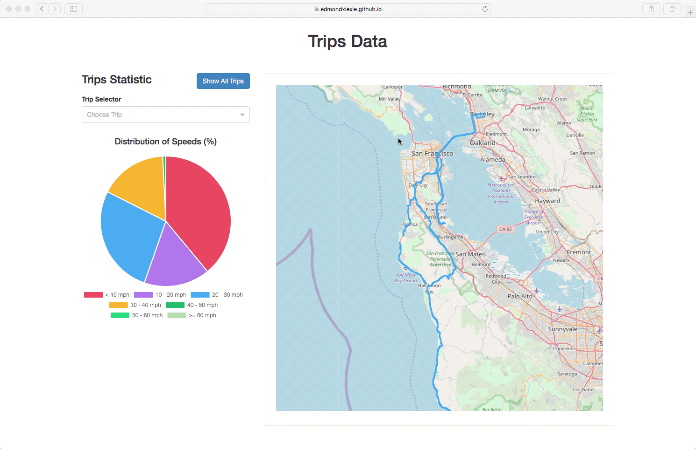
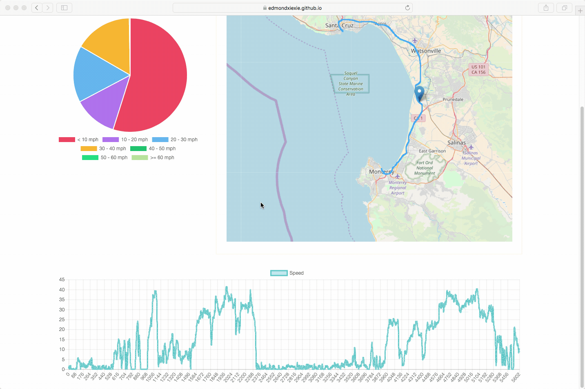

# Trips Map

Live: [https://edmondxiexie.github.io/trip-map/](https://edmondxiexie.github.io/trip-map/)

Trips Map a React app containing an interactive map visualizing the distribution of speeds along trips. The app reads the data from sample json files.

## Features & Implementation

You can choose a single trip by choosing trip name in the dropdown list or directly clicking the route on the map.

The Pie Chart on the left shows the rough distribution of the speeds along this trip. And the Line Chart in the bottom shows the detail of every single record along the trip. By clicking the dot on the chart, a marker will display on the corresponding position on the map, showing the coordinate and the speed at this position.

